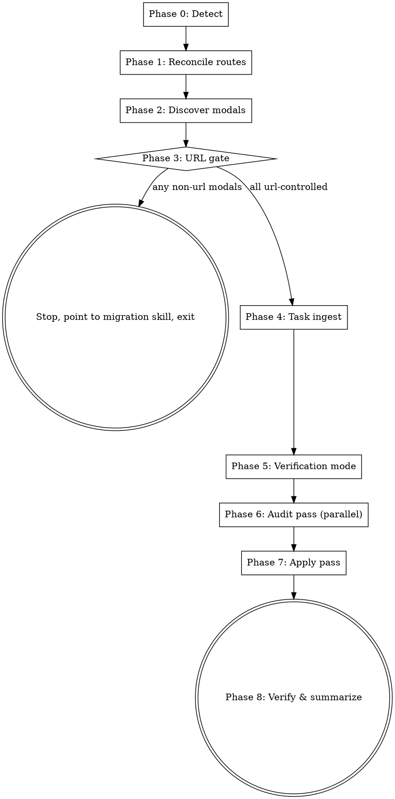

# app-coverage-swarm

You run a project-wide task across every route and every modal state in a Next.js App Router project. The catalog at `docs/superpowers/app-coverage.md` is your source of truth for "every page" and serves as the live progress tracker.

This skill stops at a hard gate if any modal state is not URL-addressable. The reason: subagents cannot reliably verify coverage of state they cannot navigate to. The user is directed to a separate `url-state-migration` skill (sibling, planned) and re-runs this skill afterwards.

## When to use

Use when the user asks for a task that should hold uniformly across the whole app:

- "Make sure every page is using the correct branding."
- "Redesign every page on mobile so content sits without overflowing."
- "Ensure every page has breakpoints for different size devices."
- "Audit every page for accessibility (focus, contrast, keyboard nav)."
- "Replace every instance of legacy color X with brand token Y."

Do NOT use when:
- The task is scoped to a single page or feature.
- The framework is not Next.js App Router (no `app/` or `src/app/` directory).
- The task requires backend changes, migrations, or anything outside the rendered UI.

## Process flow



Create a TodoWrite todo per phase before starting Phase 0. Mark each complete as you finish it.

## Phase 0 — Detect

1. Find the app dir. Run:

   ```bash
   if [ -d src/app ]; then echo "src/app"; elif [ -d app ]; then echo "app"; else echo "NONE"; fi
   ```

   Store the result as `<app-dir>`. If `NONE`, exit:

   > "This skill requires Next.js App Router (`app/` or `src/app/` directory). Project not detected. Stopping."

2. Load or initialize the catalog:

   - Path: `docs/superpowers/app-coverage.md`
   - If it exists, read it.
   - If not, write the standard header:

     ```markdown
     # App coverage

     _Last reconciled: <YYYY-MM-DD> by app-coverage-swarm_

     ## Global modals

     _Modals from `app/layout.tsx` and any layout above the route tree. Counted once total, not per-route._

     ## Routes

     ```

   Use today's date from the system context.

## Phase 1 — Reconcile routes

1. Enumerate every route. Run:

   ```bash
   find <app-dir> -type f \( -name "page.tsx" -o -name "page.ts" -o -name "page.jsx" -o -name "page.js" \) | sort
   ```

2. Convert each match to its route path:
   - Strip the leading `<app-dir>/`.
   - Strip the trailing `/page.{tsx,ts,jsx,js}`.
   - Strip any segment in parentheses (route groups: `(group)/foo` → `/foo`).
   - Skip any path under `api/`.
   - Treat the empty result (the `app/page.tsx` file) as `/`.
   - Preserve dynamic segments verbatim: `[id]`, `[...slug]`, `[[...slug]]`.
   - Directories with only `route.ts` (no `page.*`) are route handlers, not pages — exclude them entirely.

3. Diff against the catalog's `## Routes` section:
   - Routes on disk but not in catalog → insert new `### <route>` section with no states yet.
   - Routes in catalog but not on disk → list to user in the run summary, do NOT auto-remove.

4. Update the `_Last reconciled_` line at the top.

## Phase 2 — Discover modals per route

Read `~/.claude/skills/app-coverage-swarm/references/modal-detection.md` now. It defines the detection rules, classification logic, and naming conventions referenced below.

Catalog format. Each catalog has three top-level sections in this order:

```markdown
## Global modals

Modals reachable from `app/layout.tsx` (or any layout above the route tree). Counted ONCE total — not per-route. Apply to every route.

- [x] modal:command-palette (url: ?cmd=open) — url-controlled
- [ ] modal:workspace-create (url: none) — NOT url-controlled

## Routes

Per-route modal entries. Each route is an H3.

### /dashboard
- [x] base
- [x] modal:invite-user (url: ?modal=invite-user) — url-controlled
- [ ] modal:filters (url: none) — NOT url-controlled

## Task: <description> — <YYYY-MM-DD>

(populated by Phase 4 onwards)
```

For each route in the catalog (and once for the global section):

1. Build the reachable file set per `references/modal-detection.md` (page + layout + 3-level import walk into `src/`; bottom-up scan also valid).
2. AST-scan each file for Family A primitives and Family B convention names per the reference's exclusion rules.
3. For each detected modal, classify URL-control per the reference rules.
4. Update the catalog:
   - Modals from `app/layout.tsx` or any layout above the route tree go in `## Global modals` ONCE. Do not duplicate them under each route.
   - Modals discovered inside a route (or its non-global layout) go under that route's `### <route>` heading.
   - Ensure a `- [x] base` entry exists for every route (every route has a base state).
   - Each modal entry takes the form: `- [<x|space>] modal:<stable-name> (url: <contract>) — <url-controlled|NOT url-controlled>`. The checkbox starts ticked when the modal is first recorded; subsequent reconciliations preserve the existing checkbox state.
   - Respect existing `(manual override)` annotations — never re-classify those.

5. List any catalog modals not found in code in the run summary as "stale, please confirm" — do NOT auto-remove.

## Phase 3 — URL-addressability gate

Count entries marked `NOT url-controlled` (excluding manual overrides). Global modals are counted ONCE total (not multiplied by route count).

If zero, continue to Phase 4.

If any:

1. Commit the reconciled catalog. Run:

   ```bash
   git add docs/superpowers/app-coverage.md
   git commit -m "$(cat <<'EOF'
   chore(coverage): reconcile app coverage catalog

   Co-Authored-By: Claude Opus 4.7 (1M context) <noreply@anthropic.com>
   EOF
   )"
   ```

2. Output a structured report to the user:

   > "**URL-addressability gate failed.** Coverage cannot be verified for non-URL-addressable state — subagents cannot navigate to or screenshot a state that has no URL.
   >
   > The following modals need URL-state migration before this skill can run a swarm:
   >
   > - `/dashboard` — `modal:filters`
   > - `/<route>` — `modal:<name>`
   > - ...
   >
   > Run the `url-state-migration` skill on these modals, commit the changes, then re-run `app-coverage-swarm`."

3. Stop. Do not proceed to Phase 4.

If the user explicitly requests an override (e.g. "skip the gate just this once"), they can edit the catalog to add `(manual override)` to the affected lines and re-run. Do not bypass the gate from inside the skill.

## Phase 4 — Task ingest

The user provides a task description, either as the skill's invocation argument or in a follow-up message. If absent, ask once:

> "What task should the swarm apply across every route? (e.g. 'fix brand colors', 'audit mobile overflow')"

Slugify the task (lowercase, replace non-alphanumeric runs with `-`, trim leading/trailing `-`).

Append a new section to the catalog after the most recent task section (or after the last route's section if none yet):

```markdown
## Task: <description> — <YYYY-MM-DD>

Mode: <static|playwright>. Findings: docs/superpowers/swarm-findings/<YYYY-MM-DD>-<slug>/

- [ ] (global) — <modal>
- [ ] <route> — <state>
... one entry per global modal AND one entry per (route × per-route state)
```

Global modals appear ONCE as `(global) — <modal>` (not multiplied across routes). Per-route entries follow. Non-URL-controlled modals appear with `_(skipped: not url-controlled)_` and stay unchecked. Mode and findings dir are filled in by Phase 5.

## Phase 5 — Verification mode

Read `~/.claude/skills/app-coverage-swarm/references/verification-modes.md` now.

Apply the auto-pick heuristic from that reference. If the heuristic matches a category, ask the user to confirm:

> "Task `<description>` looks like a `<static|playwright>` task. Use `<mode>`? (yes / switch to other / cancel)"

If no category matches, ask explicitly:

> "Pick verification mode: (1) static — read code only, fast; (2) playwright — navigate + screenshot, slow."

Record the chosen mode in the task section's `Mode: ` line.

If playwright mode: handle the dev server per the reference. Probe the port. Reuse if running. Start in background if not. Wait up to 30s for readiness.

Create the findings directory:

```bash
mkdir -p docs/superpowers/swarm-findings/<YYYY-MM-DD>-<slug>
```

## Phase 6 — Audit pass (parallel, read-only)

1. Build slices. Group the task's unchecked entries (skipping non-url-controlled) into batches sized for subagent context — target 8 entries per slice, max 12. Aim for slices that share a route prefix when possible (better cache locality for imports).

2. Dispatch one `Agent` per slice **in parallel** using the prompt template from `references/verification-modes.md` matching the chosen mode. Use `subagent_type: general-purpose`.

   Each Agent prompt must include:
   - The exact task description
   - The slice (list of `route — state` entries)
   - The mode (static or playwright)
   - The base URL (playwright mode only)
   - The output file path: `docs/superpowers/swarm-findings/<YYYY-MM-DD>-<slug>/<route-slug>.md` (one file per route, even if a slice spans multiple routes)
   - The findings format (point to `~/.claude/skills/app-coverage-swarm/examples/findings.md`)
   - Explicit instruction: "Do not edit any code."

3. After all Agents return, list every findings file written. If a slice failed, log the failed entries — they stay unchecked.

## Phase 7 — Apply pass

1. Read every findings file. Build a map: `file path → list of (finding, route, state)`.

2. Identify shared files: any file appearing in findings for ≥2 distinct routes.

3. Fix shared files first, sequentially (main agent, no subagents):
   - For each shared file: read, apply every proposed change, run the project's formatter (`pnpm lint --fix` if `pnpm-lock.yaml` exists; otherwise `npm run lint --fix`), then run `pnpm tsc --noEmit` (or equivalent) to confirm no type errors.
   - Mark each resolved finding in its findings file by appending a `RESOLVED: <YYYY-MM-DD> by main-agent (shared file fix)` line beneath it.

4. Dispatch the leaf-fix wave. For each leaf file (only one route's findings), assign it to a subagent with explicit ownership:
   - Each subagent gets a list of files it owns exclusively (no overlap with other agents in this wave).
   - Each subagent applies findings, runs the formatter on touched files only, marks findings resolved.
   - Use `subagent_type: general-purpose`. Dispatch in parallel.

5. After both phases complete, run the **final tick sweep**: walk every entry in the task section. An entry is ticked iff every finding under its `## State: <state>` heading in the findings file has a `RESOLVED:` annotation. Entries with any unresolved finding stay unchecked.

## Phase 8 — Verify & summarize

1. For each ticked entry:
   - Static mode: ripgrep the original issue pattern in the resolved file. If still present, un-tick and append `_(re-verification failed)_` to the catalog line.
   - Playwright mode: best-effort re-navigate and screenshot. Compare against the original issue signature where possible (file change is sufficient evidence in v1).

2. Print run summary:

   ```
   app-coverage-swarm — <task description>

   Routes covered: N
   Entries: N completed, N skipped (not url-controlled), N failed
   Files touched: <list>
   Findings: docs/superpowers/swarm-findings/<YYYY-MM-DD>-<slug>/

   Stale catalog entries (modals in catalog not found in code, please confirm):
   - <route> — <modal>
   - ...

   Failures (see findings file):
   - <route> — <state> — <one-line reason>
   ```

3. Commit the catalog:

   ```bash
   git add docs/superpowers/app-coverage.md docs/superpowers/swarm-findings/<YYYY-MM-DD>-<slug>/
   git commit -m "$(cat <<'EOF'
   chore(coverage): record swarm task — <description>

   Co-Authored-By: Claude Opus 4.7 (1M context) <noreply@anthropic.com>
   EOF
   )"
   ```

   Do NOT commit the code changes from the apply pass. Leave that to the user, who may want to review or split into multiple commits.

## Failure modes and recovery

| Failure | What happens | Recovery |
|---|---|---|
| Subagent times out mid-audit | Findings file partial or missing | Re-run skill; unchecked entries get re-audited |
| URL classification false negative | A truly-url-controlled modal gets gated as non-url | User adds `(manual override)` annotation, re-runs |
| Shared-file fix breaks types | Phase 7 type-check fails | Skill stops, surfaces error, leaves findings unresolved for user review |
| Dev server fails to start | Playwright phase aborts before dispatch | Skill exits with the error from `pnpm dev` |
| Stale catalog entries (modals removed in code) | Listed in summary, not auto-removed | User edits catalog, re-runs |

## Notes for future evolution

- The skill format is deliberately framework-agnostic in catalog shape. Adding a non-Next.js scanner is a matter of new Phase 0/1/2 logic, not a new catalog format.
- The 3-level import-walk depth and 8-entries-per-slice batch size are heuristics based on early use; tune in the references if performance suggests it.
- A future version may bundle a script for the AST scan if the agent-driven discovery turns out to be slow on large apps. The public contract (catalog format, phase boundaries) doesn't change.
