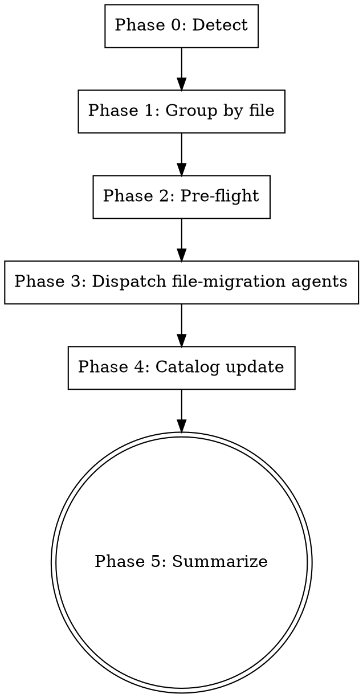

# url-state-migration

You convert catalog-flagged non-URL modal state to URL-controlled state using `nuqs`. This skill is the unblocker for `app-coverage-swarm`'s URL-addressability gate.

The work is per-file, parallel, and bounded by the catalog. You do not invent migrations — the recipes in `references/migration-recipes.md` are the only patterns the dispatched agents apply.

## When to use

Use when:
- `app-coverage-swarm` halted at the URL-addressability gate, listing modals as `NOT url-controlled`.
- The user wants those modals migrated to URL-controlled state so the swarm can verify coverage.
- The project has `nuqs` as a dependency.

Do NOT use when:
- The catalog at `docs/superpowers/app-coverage.md` does not exist (run `app-coverage-swarm` first).
- The project does not depend on `nuqs`.
- The user wants to migrate non-modal URL state (filters, pagination) — out of scope.
- Working tree has uncommitted tracked changes.

## Process flow



Create a TodoWrite todo per phase before starting Phase 0. Mark each complete as you finish it.

## Phase 0 — Detect

1. Verify catalog exists:

   ```bash
   test -f docs/superpowers/app-coverage.md && echo OK || echo MISSING
   ```

   If `MISSING`, exit:
   > "No catalog found at docs/superpowers/app-coverage.md. Run `app-coverage-swarm` first to build it."

2. Verify nuqs is a dependency:

   ```bash
   grep -E '"nuqs":' package.json
   ```

   If no match, exit:
   > "This skill requires nuqs as a dependency. Install with `pnpm add nuqs` and re-run."

3. Read the catalog. Parse all modal entries marked `NOT url-controlled`, from both `## Global modals` and `## Routes` sections. Exclude entries containing `(manual override)`.

4. If zero entries to migrate, exit cleanly:
   > "All modals in the catalog are already url-controlled (or manually overridden). Nothing to migrate."

## Phase 1 — Group by file

**Cheap pre-flight gates run FIRST** so a dirty tree or protected branch fails fast before the expensive grep walk. Run these checks before doing any source-file lookup:

1. Confirm no modified or staged tracked files (untracked files are fine):

   ```bash
   git diff --quiet && git diff --cached --quiet
   echo $?
   ```

   If non-zero, list the dirty files for the user (`git status --short`) and exit:
   > "Working tree has uncommitted tracked changes:
   > <git status output>
   > Commit or stash before running this skill — each file migration is its own commit and a dirty tree breaks that contract."

2. Confirm current branch is not `main` or `master`:

   ```bash
   branch=$(git rev-parse --abbrev-ref HEAD)
   case "$branch" in main|master) echo PROTECTED;; *) echo OK;; esac
   ```

   If `PROTECTED`, exit:
   > "Refusing to migrate on main/master. Create a feature branch first."

If both gates pass, proceed with the source-file lookup below.

For each catalog entry to migrate, locate its source file. The catalog does not record source paths on entry lines, so you grep:

**Family B lookup** (when the stable name maps to a real component identifier):

Convert the stable name to PascalCase. For each modal-suffix candidate (`Dialog`, `Sheet`, `Drawer`, `Modal`):

```bash
rg -l "<${PascalCase}${Suffix}\b" src/
```

The owning file is the one that contains the JSX render site.

**Family A lookup** (anonymous primitive):

Real code routinely drops domain/feature prefixes from local variables (a `workspace-create` modal inside `workspace-switcher.tsx` is just `createOpen`; an `invoices-preview-sheet` in `invoices-hub-dashboard.tsx` is just `isPreviewOpen`). The lookup tries progressively shorter candidates.

Build candidate variable names from the kebab-case stable name in this priority order:

1. **Full name** — kebab → camelCase, plus `is*Open`/`*Open` variants:
   - `invite-user` → `inviteUser`, `inviteUserOpen`, `isInviteUserOpen`
   - `transaction-edit` → `editingTransaction`, `editingTransactionId`, `transactionEdit`, `isTransactionEditOpen`

2. **Last-segment fallback** (when name has ≥2 segments) — drop all but the last segment, plus its `*Open` variants:
   - `workspace-create` → `create`, `createOpen`, `isCreateOpen`, `creating`
   - `finance-account-create` → `create`, `createOpen`, `isCreateOpen`
   - `finance-transaction-edit` → `edit`, `editing`, `editingId`, `isEditOpen`

3. **Trailing-pair fallback** (when name has ≥3 segments) — drop all but the last 2, camelCased:
   - `finance-account-create` → `accountCreate`, `accountCreateOpen`, `isAccountCreateOpen`
   - `invoices-preview-sheet` → `previewSheet`, `previewOpen`, `isPreviewOpen` (also drop the trailing modal-suffix word `sheet`/`dialog`/`drawer`/`modal` and try the result: `preview`, `isPreviewOpen`)

For each candidate (in priority order, stopping at first hit), run:

```bash
rg -l "(useState\b.*\b${candidate}\b|const \[${candidate}\b)" src/
```

Filter results to files that ALSO contain a Family A primitive render (`<Dialog`, `<Sheet`, `<Drawer`, `<AlertDialog`, `<CommandDialog`, `<DrawerPrimitive\.Root`).

**Confidence check**: when using fallback 2 or 3, the candidate is generic enough (`create`, `edit`, `preview`) to match many files. Disambiguate by checking the file's path matches the route's feature directory:

- For per-route entries (`### /<route>`): the file path should contain a feature directory whose name matches part of the route (e.g. modal under `/wealth/accounts` should be in `src/features/finance/` or similar — the route prefix maps to the feature).
- For globals (`## Global modals`): match anywhere under `src/features/` or `src/components/`.

If multiple files survive filtering and disambiguation, pick the one whose path most closely matches the catalog's route or stable-name segments. If still ambiguous, skip and surface in Phase 5.

**If no single file is found**: skip the entry, surface in Phase 5 summary as `needs manual catalog edit`. Do not guess.

**If the catalog line includes an explicit `[file: src/...]` annotation**: use that, skip the grep. The user can hand-add this annotation for unfindable modals and re-run.

Build the file-ownership map: `Map<filePath, ModalEntry[]>`. Each file goes to exactly one agent in Phase 3. For each modal in the map, also derive the suggested URL param name (the catalog's stable name verbatim).

## Phase 2 — Load references and per-file checks

The cheap working-tree and branch gates already ran at the top of Phase 1. Phase 2 covers reference loading and per-file decisions.

1. Read the references that will be composed into agent prompts:
   - `~/.claude/skills/url-state-migration/references/agent-prompt.md`
   - `~/.claude/skills/url-state-migration/references/migration-recipes.md`
   - `~/.claude/skills/url-state-migration/references/nuqs-patterns.md`

2. For each file in the ownership map, count its modals. If any file has >4 modals, ask the user:

   > "File `<path>` has <N> modals to migrate. Files with many coupled modals are harder to migrate atomically. Proceed for this file, or defer to manual review? (proceed / defer)"

   If `defer`, remove that file from the map and surface its entries in Phase 5 as deferred.

## Phase 3 — Dispatch file-migration agents

For each file in the map, dispatch one Agent in parallel. Use the prompt template from `references/agent-prompt.md`, filled in with:
- File path (absolute)
- Modal list (each line: `<stable-name> | <classification hint> | <current pattern hint> | <suggested param name>`)
- The reference paths
- The feature directory name (extracted from the file path: e.g. `src/features/invoices/foo.tsx` → `invoices`)

Use `subagent_type: general-purpose`. All Agents dispatch in a single message (parallel).

After all Agents return, for each one:

1. Inspect its commit (if it reported DONE or DONE_WITH_CONCERNS with a SHA):

   ```bash
   git show --name-only --pretty=format: <sha>
   ```

   The output should list ONLY the assigned file. If anything else appears:

   ```bash
   git revert --no-edit <sha>
   ```

   Mark all of that file's modals as BLOCKED for Phase 4. Surface the overreach in Phase 5.

2. If the agent reported BLOCKED, no commit was made. Mark all of that file's modals as BLOCKED.

3. If the agent reported DONE_WITH_CONCERNS, accept the commit but record the per-modal results — some modals may have been skipped (Recipes 4-6) and stay `NOT url-controlled` in the catalog.

## Phase 4 — Catalog update

Read `docs/superpowers/app-coverage.md` fresh. For each successfully migrated modal:

1. Find its line in the catalog (under `## Global modals` or its `### /<route>` heading).
2. Edit the line:
   - Replace `(url: none)` with the new URL contract:
     - Boolean modals: `(url: ?<param-name>=1)`
     - ID-carrying modals: `(url: ?<param-name>=<id>)`
   - Replace `NOT url-controlled` with `url-controlled`.

3. Update the `_Last reconciled_` line at the top to today's date (use the system context's current date).

Modals that the agents skipped (DONE_WITH_CONCERNS) or that were in BLOCKED files retain their original lines. Do NOT change them.

Commit the catalog update separately from the per-file migration commits:

```bash
git add docs/superpowers/app-coverage.md
git commit -m "$(cat <<'EOF'
chore(coverage): mark modals url-controlled after migration

Co-Authored-By: Claude Opus 4.7 (1M context) <noreply@anthropic.com>
EOF
)"
```

## Phase 5 — Summarize

Print:

```
url-state-migration — <YYYY-MM-DD>

Files processed: N
Modals migrated: N
Modals skipped (BLOCKED files): N
Modals skipped (pattern unrecognized — Recipes 4/5/6): N
Modals skipped (source file not located): N
Files deferred (>4 modals, user declined): N

Per-file results:
- <path> — DONE — <count> modal(s): <name1>(?<param>=<shape>), ...
- <path> — DONE_WITH_CONCERNS — see notes
- <path> — BLOCKED — <error summary>

Skipped modals (need manual attention):
- <route> — <stable-name> — <reason>
- ...

Next step:
Re-run `app-coverage-swarm` to verify the URL-addressability gate now passes.
If it still fails, the skipped modals above need manual review.
```

Do NOT auto-invoke `app-coverage-swarm`. The user reviews commits first.

## Failure modes and recovery

| Failure | What happens | Recovery |
|---|---|---|
| Catalog missing | Phase 0 exits with message | User runs `app-coverage-swarm` first |
| nuqs not a dependency | Phase 0 exits with message | User installs nuqs (`pnpm add nuqs`) |
| Working tree dirty (tracked) | Phase 2 exits before any change | User commits or stashes, re-runs |
| On main/master | Phase 2 exits | User creates a feature branch, re-runs |
| Agent typecheck fails | Agent reports BLOCKED, no commit | Modals stay `NOT url-controlled`; user reviews and migrates manually |
| Agent edits files outside its scope | Phase 3 reverts the commit, marks modals BLOCKED | Surface in summary; user investigates |
| Source file not located | Modal skipped, surfaced as `needs manual catalog edit` | User adds `[file: src/...]` annotation to catalog line, re-runs |
| Pattern unrecognized (Recipes 4-6) | Modal skipped DONE_WITH_CONCERNS | User migrates manually |

## Notes for future evolution

- v1 ships only Recipes 1-3. Adding recipes for Context (4) and store (5) requires escaping the file-ownership boundary, which is a meaningful design change. Recipe 6 (useReducer) is similar.
- Source-file lookup via grep is heuristic. A future version could amend the `app-coverage-swarm` catalog format to record source paths on entry lines, eliminating this step.
- The `>4 modals` threshold for the user prompt is a heuristic. Tune based on operational experience.
